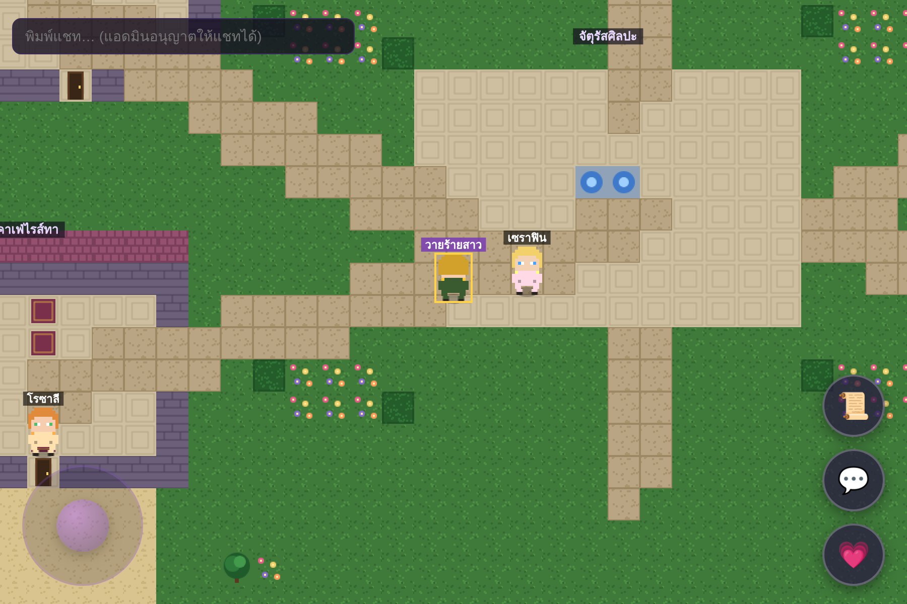

# ✦ Spirit World MMORPG — วิญญาณข้ามมิติ: วายร้ายแห่งอเล็กเทียร์

เกม **MMORPG พิกเซลอาร์ต มุมมองบนลงล่าง (top-down)** ธีมนิยายแฟนตาซีน้ำเน่าในโรงเรียนเวทศิลป์
คุณตื่นขึ้นในร่างของ **“ตัวร้ายที่ใคร ๆ ก็รังเกียจ”** — ภารกิจของคุณคือพลิกชะตา สำรวจโลกกว้างแห่ง
**อเล็กเทียร์** และ **จีบใครก็ได้ในแมพ** เพื่อเขียนตอนจบของคุณเอง

เล่นได้ทั้ง **คอมพิวเตอร์และมือถือ** ผ่านเบราว์เซอร์ • ผู้เล่นติดตั้งเซิร์ฟเวอร์เองผ่าน **Termux**
• มีระบบ **แอดมินอนุมัติ/ปฏิเสธ/แบน** ผู้เล่น และ **อัปเดตเนื้อหาเกมแบบเรียลไทม์**



---

## ✨ ฟีเจอร์

- 🕹️ **เดิน 4 ทิศ + อนิเมชันขาเดินจริง** ด้วย WASD / ลูกศร (คอม) หรือ **จอยสติ๊กสัมผัส** (มือถือ)
- 🎥 **กล้องเลื่อนตามตัวละครตลอดเวลา**
- 🌐 **มัลติเพลเยอร์เรียลไทม์** ผ่าน WebSocket — เห็นผู้เล่นคนอื่นเดินไปมา + แชทในโลก
- 💗 **ระบบจีบ/ความสัมพันธ์ (Affection)** — คุยกับ NPC ทุกตัว เลือกบทพูด เพิ่มค่าหัวใจ ♥
- 📜 **ภารกิจ (Quests) + เนื้อเรื่องเป็นบท** และระบบ **ชื่อเสียง (Reputation)**
- 🛡️ **แผงควบคุมแอดมิน** — อนุมัติ / ปฏิเสธ / แบน ผู้เล่น และเปิด-ปิดสิทธิ์แชทได้ตลอดเวลา
- ⚡ **Content API แบบ Hot-Reload** — แก้ NPC / บทสนทนา / เควส แล้วผู้เล่นทุกคนเห็นทันที
- 🎨 **พิกเซลอาร์ตแบบ Procedural** — ไม่ต้องมีไฟล์รูปภาพเลย ตัวละครและแมพวาดด้วยโค้ด
- 📦 **ติดตั้งง่ายบน Termux** — พึ่งพาแค่ Node.js + `ws` ตัวเดียว

---

## 📲 ติดตั้งและเล่นบนมือถือ (Termux)

> Termux คือแอปจำลอง Linux terminal บน Android — โหลดได้จาก **F-Droid** (แนะนำ) หรือ GitHub

```bash
# 1) อัปเดตและติดตั้งเครื่องมือ
pkg update && pkg upgrade -y
pkg install nodejs git -y

# 2) โคลนโปรเจกต์
git clone https://github.com/hamhamm1/game.git
cd game

# 3) ติดตั้ง dependency
npm install

# 4) ตั้งรหัสแอดมินของคุณเอง แล้วรันเซิร์ฟเวอร์
ADMIN_TOKEN=รหัสลับของคุณ npm start
```

จากนั้นเปิดเบราว์เซอร์:

| เข้าเล่น | ที่อยู่ |
|---|---|
| 🎮 หน้าเกม (เครื่องเดียวกัน) | `http://localhost:8080/` |
| 🛡️ แผงแอดมิน | `http://localhost:8080/admin` |
| 📱 เล่นจากมือถือเครื่องอื่น | `http://<IP เครื่องเซิร์ฟเวอร์>:8080/` |

> หา IP ของเครื่องได้ด้วยคำสั่ง `ifconfig` หรือ `ip addr` (มองหา `192.168.x.x`)
> ให้ทุกคนอยู่ใน**WiFi วงเดียวกัน** แล้วเข้าผ่าน IP นั้นได้เลย

---

## 💻 ติดตั้งบนคอมพิวเตอร์ (Windows / macOS / Linux)

ต้องมี [Node.js](https://nodejs.org) เวอร์ชัน 18 ขึ้นไป

```bash
git clone https://github.com/hamhamm1/game.git
cd game
npm install
ADMIN_TOKEN=รหัสลับของคุณ npm start   # Windows (PowerShell): $env:ADMIN_TOKEN="รหัส"; npm start
```

เปิด `http://localhost:8080/` แล้วกดปุ่ม **เข้าสู่โลกอเล็กเทียร์**

---

## 🛡️ การเป็นแอดมิน (อนุมัติ / แบนผู้เล่น)

1. เปิด `http://localhost:8080/admin`
2. กรอก **ADMIN_TOKEN** (ตัวเดียวกับที่ตั้งตอนรันเซิร์ฟเวอร์) แล้วกด **เชื่อมต่อ**
3. เมื่อมีผู้เล่นกด “เข้าสู่โลก” จะปรากฏสถานะ **รออนุมัติ** ในตาราง
4. กด **อนุมัติ** เพื่อให้เขาเข้าเล่น / **แบน** เพื่อปฏิเสธหรือเตะออก / **พัก** เพื่อกลับเป็นรออนุมัติ
5. ปุ่ม **เปิด/ปิดแชท** ควบคุมสิทธิ์การพิมพ์แชทของผู้เล่นแต่ละคน

การตัดสินใจทุกอย่างมีผล **ทันที** — คนที่ถูกแบนจะโดนเตะออกจากโลกเดี๋ยวนั้น

### แก้เนื้อหาเกมสด ๆ (Realtime)
ในแผงแอดมิน เลือกหมวด (`npcs` / `quests` / `dialogues` / `events`) → **โหลด** → แก้ JSON → **💾 อัปเดตสด**
ผู้เล่นทุกคนจะเห็นการเปลี่ยนแปลงทันทีโดยไม่ต้องรีสตาร์ตเซิร์ฟเวอร์
(หรือแก้ไฟล์ในโฟลเดอร์ `content/` ตรง ๆ — เซิร์ฟเวอร์จับการเปลี่ยนแปลงและรีโหลดให้เอง)

---

## 🎮 วิธีเล่น

| การกระทำ | คอม | มือถือ |
|---|---|---|
| เดิน | `W A S D` / ลูกศร | จอยสติ๊กซ้ายล่าง |
| คุย / เลือกตัวเลือก | `Space` / `E` / `Enter` | ปุ่ม 💗 |
| เปิดภารกิจ & ความสัมพันธ์ | ปุ่ม 📜 | ปุ่ม 📜 |
| แชท | พิมพ์ในช่องซ้ายบน + `Enter` | ปุ่ม 💬 |

เดินเข้าใกล้ NPC (เช่น **เซราฟิน** นางเอกตัวจริง, **เจ้าชายอาริค**, **นิกซ์** เด็กลึกลับ) แล้วกดคุย
เลือกบทพูดที่ถูกใจเพื่อเพิ่มค่าหัวใจ ♥ — ยิ่งความสัมพันธ์สูง ชื่อเสียงของวายร้ายก็ยิ่งพลิกกลับ

---

## 🗺️ โลกของเกม

อ้างอิงจากแผนที่ **ทวีปอเล็กเทียร์ — เมืองแห่งศิลปะ**:
อาคารเรียนหลัก • จัตุรัสศิลปะ (มีน้ำพุ) • หอพักหญิง/ชาย • ห้องสมุดต้องห้าม •
คาเฟ่ไรส์ทา • ลานฝึกดวล • ทะเลสาบต้องสาป • ประตูเมืองทิศใต้

---

## 🏗️ สถาปัตยกรรม

```
server.js                 HTTP static + Admin REST API + WebSocket
src/shared/
  constants.js            ค่าคงที่ที่ client & server ใช้ร่วมกัน
  worldgen.js             ตัวสร้างแมพ (แหล่งความจริงเดียว เสิร์ฟให้ทั้งสองฝั่ง)
src/server/
  gameServer.js           โลกเรียลไทม์: การเคลื่อนที่, แชท, บทสนทนา, tick 15Hz
  players.js              บัญชีผู้เล่น + สถานะอนุมัติ + ความสัมพันธ์ (บันทึกลง data/)
  content.js              โหลด/hot-reload เนื้อหาเกม
  collision.js            การชนฝั่งเซิร์ฟเวอร์
  store.js                persistence เป็นไฟล์ JSON
content/                  npcs / quests / dialogues / events (แก้ได้)
public/                   ไคลเอนต์ (Canvas + JS ล้วน)
  js/pixel.js             พิกเซลอาร์ต procedural (ตัวละคร, ไทล์, พอร์เทรต)
  js/renderer.js          กล้อง + การวาดโลก/เอนทิตี
  js/game.js              ลูปหลัก + client prediction + interpolation
  admin.html              แผงควบคุมแอดมิน
```

**Stack:** Node.js (ESM) + `ws` ฝั่งเซิร์ฟเวอร์ • HTML5 Canvas + Vanilla JS ฝั่งไคลเอนต์
ไม่มี build step, ไม่มีฐานข้อมูล, ไม่มี asset ภายนอก — เหมาะกับการรันบน Termux

---

## 🔌 API อ้างอิง

| Method | Endpoint | คำอธิบาย |
|---|---|---|
| `POST` | `/api/join` | ผู้เล่นขอเข้าร่วม (สร้างบัญชีสถานะ pending) |
| `GET` | `/api/admin/players` | รายชื่อผู้เล่นทั้งหมด *(ต้องมี token)* |
| `POST` | `/api/admin/decision` | `{id, action:"approve"\|"ban"\|"pending"}` |
| `POST` | `/api/admin/chat` | `{id, canChat:bool}` เปิด/ปิดสิทธิ์แชท |
| `GET` | `/api/admin/content` | ดึงเนื้อหาปัจจุบัน |
| `POST` | `/api/admin/content` | `{kind, payload}` อัปเดตเนื้อหาสด |
| `POST` | `/api/admin/reload` | รีโหลดเนื้อหาจากไฟล์ |

การเรียก admin ต้องแนบ header `Authorization: Bearer <ADMIN_TOKEN>`

---

## 🚧 Roadmap (แผนต่อยอด)

- [ ] ระบบเข้าอาคาร (interior maps) ตามแผนที่โรงเรียน 11 จุด
- [ ] เควสแบบมีเงื่อนไข/ติดตามความคืบหน้าอัตโนมัติ
- [ ] อีเวนต์ตามเวลา (งานเต้นรำราตรีจันทรา, เทศกาลศิลปะ)
- [ ] Inventory & ของขวัญเพิ่มค่าหัวใจ
- [ ] บันทึกความสัมพันธ์เป็น “route” และฉากจบหลายแบบ (multiple endings)
- [ ] ระบบต่อสู้/ประลองที่ลานฝึกดวล

---

## ⚙️ ตั้งค่า

| Env | ค่าเริ่มต้น | ความหมาย |
|---|---|---|
| `PORT` | `8080` | พอร์ตเซิร์ฟเวอร์ |
| `ADMIN_TOKEN` | `changeme-admin` | **เปลี่ยนก่อนเปิดใช้จริงเสมอ** |

## 📄 License
MIT
